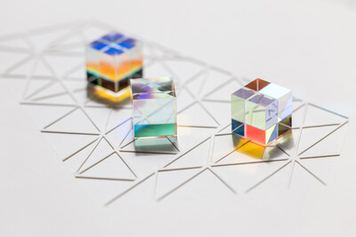

# Lightwall: An Installation That Sees You



# Introduction
Created by artist [Rita Sus](https://emit-light.com), technologist [Zach Rattner](https://zachrattner.com), and students from [California State Fullerton](https://www.fullerton.edu/), Lightwall places the visitor at the center of the artwork's unfolding behavior. Rather than generating images or automating creativity, the piece uses AI as an expressive instrument: one that senses, reacts, and performs in the room.

Built from rotating prisms, custom electronics, and precisely controlled lighting, Lightwall transforms motion and speech into evolving patterns of color and sound. Inside the structure, more than a dozen microcontrollers coordinate sensors, prisms, motors, and sound cues, all synchronized with a live AI system running locally on a single Mac mini. This compact but powerful architecture allows the installation to observe, interpret, and respond instantly, producing an encounter that feels less like digital technology and more like a sensitive, perceptive presence.

# Running Lightwall

## Install base software packages
1. Install Homebrew: https://brew.sh/
2. Download ollama: https://ollama.com/download/mac
3. Download [XCode](http://apps.apple.com/us/app/xcode/id497799835) from App Store
4. `xcode-select --install` 

## Setup environment
```zsh
./setup-env.sh
./setup-llm-server.sh
./setup-speech-recognizer.sh
```

### Run main process
```zsh
./run.sh
```

### To start automatically on boot
1. In Settings on your Mac, turn on `Start up automatically after a power failure`
2. Also in Settings, turn on automatic logic for the Lightwall user
3. Finally, in Settings, add the Lightwall.app automator workflow to the login items

This will allow the Lightwall program to run automatically when you plug the device into power. 

# The Lightwall Collective
Thank you to everyone who helped make Lightwall possible.

## Lead Artist
- [Rita Sus](https://emit-light.com)

## Technical Director
- [Zach Rattner](https://zachrattner.com)

## Engineering and Development
- Akshat Sureshbhai Desai
- Austin Nguyen
- Christian Aaron Marshall
- Dr. Christopher Ryu
- Dylan Michael Geraci
- Edmarck Osmin Sosa Pineda
- Jake Estrada
- Jose Rodrigo Aguilar García
- Harry Le
- Steven Joseph Burroughs
- Uyen Hoang Thuc Tran

## Fabrication
- [Art & Framing Solutions](https://www.artandframingsolutions.com/)

## Assembly
- Hope Rattner
- Zeke Rattner

# License
[MIT License](https://github.com/zachrattner/lightwall/blob/main/LICENSE)

# Copyright
© 2026 Worthwhile Adventures LLC
